# Docker 系统学习指南

1. [Docker 基础概念](#1-docker-基础概念)
2. [Docker 安装与配置](#2-docker-安装与配置)
3. [核心概念详解](#3-核心概念详解)
4. [实践教程](#4-实践教程)
5. [Docker Compose](#5-docker-compose)

---

## 1. Docker 基础概念

### 1.1 什么是 Docker？

Docker 是一个开源的容器化平台，允许开发者将应用程序及其依赖打包到一个轻量级、可移植的容器中。

### 1.2 容器 vs 虚拟机

| 特性 | 容器 | 虚拟机 |
|------|------|--------|
| 启动速度 | 秒级 | 分钟级 |
| 性能 | 接近原生 | 有损耗 |
| 大小 | MB 级别 | GB 级别 |
| 系统支持 | 共享宿主内核 | 独立操作系统 |

### 1.3 核心优势

- **一致性**：开发、测试、生产环境一致
- **隔离性**：应用之间相互隔离
- **轻量级**：资源占用少
- **可移植性**：一次构建，到处运行

---

## 2. Docker 安装与配置

### 2.1 Windows 安装

1. 下载 Docker Desktop for Windows
2. 启用 WSL 2 功能
3. 安装并重启
4. 验证安装：`docker --version`

### 2.2 配置镜像加速器

```bash
# 配置 Docker Daemon
# Windows: Docker Desktop -> Settings -> Docker Engine
{
  "registry-mirrors": [
    "https://docker.mirrors.ustc.edu.cn",
    "https://registry.docker-cn.com"
  ]
}
```

---

## 3. 核心概念详解

### 3.1 镜像 (Image)

镜像是只读模板，包含运行应用所需的代码、运行时、库、环境变量和配置文件。

### 3.2 容器 (Container)

容器是镜像的运行实例，可以被创建、启动、停止、移动和删除。

### 3.3 Dockerfile

用于构建镜像的文本文件，包含一系列构建指令。

### 3.4 仓库 (Registry)

存储和分发镜像的服务，Docker Hub 是最常用的公共仓库。

---

## 4. 实践教程

### 实践 1：运行第一个容器

```bash
# 拉取镜像
docker pull hello-world

# 运行容器，如果没有的话自动拉取
docker run hello-world

# 查看运行的容器
docker ps

# 查看拥有的docker镜像
docker images

# 查看所有容器（包括已停止的）
docker ps -a

# 删除镜像：
docker rmi nginx:latest

# 删除容器：
docker rm nginx:latest
```

**预期输出**：看到 "Hello from Docker!" 消息，证明 Docker 安装成功。

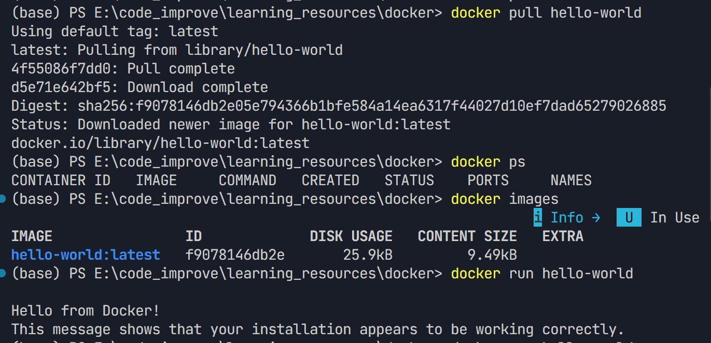

---

### 实践 2：运行 Web 应用

本地8080端口，监听虚拟机容器的80端口。

```bash
# 运行 Nginx 容器，本地没有会自动拉取
docker run -d -p 8080:80 --name my-nginx nginx

# 查看容器日志
docker logs my-nginx

# 访问 http://localhost:8080 查看 Nginx 欢迎页面

# 进入容器内部
docker exec -it my-nginx bash

# 停止容器
docker stop my-nginx

# 启动已停止的容器
docker start my-nginx

# 删除容器
docker rm -f my-nginx
```

**关键参数说明**：
- `-d`: 后台运行
- `-p`: 端口映射（宿主机端口：容器端口）
- `--name`: 容器名称

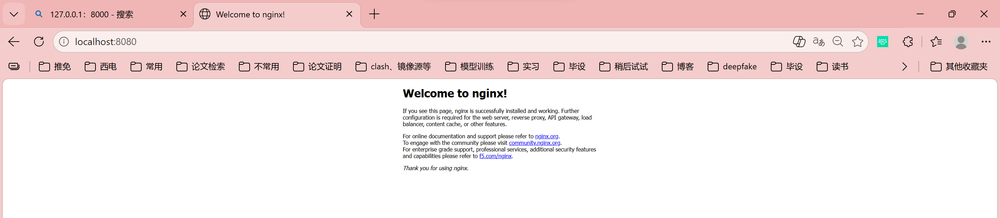

进入虚拟机容器内部，常为了验证环境、调试网络等操作。例如，进入虚拟机容器，curl localhost:8080，得到nginx欢迎的页面源代码。

既然如此，是否可以让nginx挂载本地我们想要展示的页面呢？

- 可以，一种是进入虚拟机修改index.html代码。缺点，很麻烦，修改不便，而且容器丢失了代码就丢失了。

  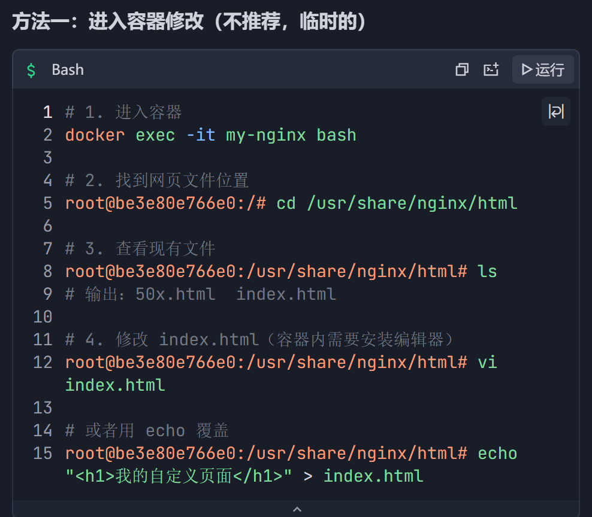

- 另一种方法更常用：让虚拟机挂载本地文件，首先删除旧的nginx容器，采用挂载的方法启动新容器。将本地的html文件夹挂在虚拟机的html文件夹处，这俩html下面都有一个index.html，也就是页面代码了。

  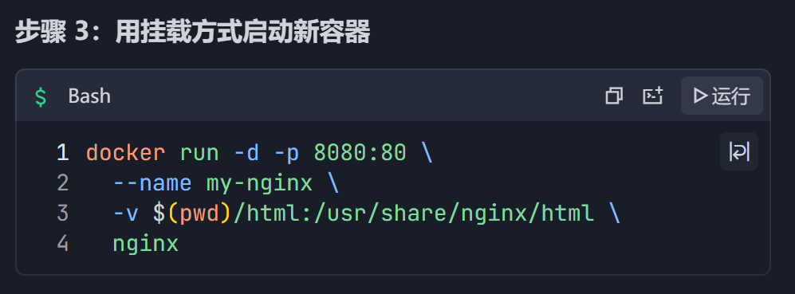

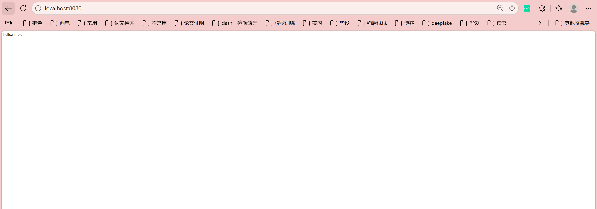

---

### 实践 3：自定义镜像构建

创建一个简单的 Python 应用：

**步骤 1：创建项目目录**
```bash
mkdir my-python-app
cd my-python-app
```

**步骤 2：创建 app.py**

app.py监听8000端口

```python
from http.server import HTTPServer, SimpleHTTPRequestHandler

class Handler(SimpleHTTPRequestHandler):
    def do_GET(self):
        self.send_response(200)
        self.send_header('Content-type', 'text/html')
        self.end_headers()
        self.wfile.write(b'<h1>Hello from Docker!</h1>')

if __name__ == '__main__':
    server = HTTPServer(('0.0.0.0', 8000), Handler)
    print('Server running on port 8000...')
    server.serve_forever()
```

**步骤 3：创建 Dockerfile**

使用官方的python镜像，把自己的代码挂在镜像下面。启动容器后，自动运行python app.py命令。

```dockerfile
# 使用官方 Python 镜像
FROM python:3.9-slim

# 设置工作目录
WORKDIR /app

# 复制应用代码
COPY app.py .

# 暴露端口
EXPOSE 8000

# 启动命令
CMD ["python", "app.py"]
```

**步骤 4：构建并运行**

访问/请求主机8000端口，映射到docker容器的8000端口，app.py接收请求，做出响应。

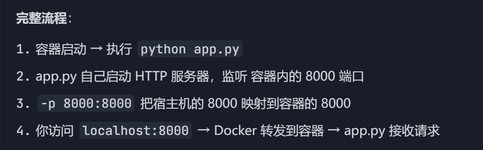

```bash
# 构建镜像
docker build -t my-python-app .

# 查看镜像
docker images

# 运行容器
docker run -d -p 8000:8000 --name my-app my-python-app

# 访问 http://localhost:8000

# 查看容器资源使用
docker stats my-app
```

---

### 实践 4：数据卷管理

```bash
# 创建数据卷
docker volume create my-volume

# 查看数据卷
docker volume ls

# 使用数据卷运行容器
docker run -d \
  --name mysql-container \
  -e MYSQL_ROOT_PASSWORD=123456 \
  -v my-volume:/var/lib/mysql \
  mysql:8

# 查看数据卷详情
docker volume inspect my-volume

# 使用绑定挂载（宿主机目录）
docker run -d \
  --name nginx-with-mount \
  -v $(pwd):/usr/share/nginx/html \
  -p 8081:80 \
  nginx

# 删除数据卷
docker volume rm my-volume
```

**数据卷 vs 绑定挂载**：
- 数据卷：由 Docker 管理，跨平台
- 绑定挂载：映射宿主机具体路径

---

### 实践 5：Docker 网络

```bash
# 创建自定义网络
docker network create my-network

# 查看网络
docker network ls

# 运行容器并连接到网络
docker run -d --name web --network my-network nginx
docker run -d --name api --network my-network python:3.9 sleep 3600

# 从 api 容器 ping web 容器
docker exec api ping web

# 查看网络详情
docker network inspect my-network

# 断开/连接网络
docker network disconnect my-network api
docker network connect my-network api
```

---

## 5. Docker Compose

（同时启动多个docker容器，并且解决了容器间的通信问题）

### 5.1 安装 Docker Compose

Docker Desktop 已内置 Docker Compose。

### 5.2 第一个 Compose 项目

创建 `docker-compose.yml`：

安全性：有的容器不暴露给外部网络，只允许在容器内部网络访问，例如数据库容器。

（1）、这里以nginx和flask两个容器为例子，介绍docker-compose的使用。

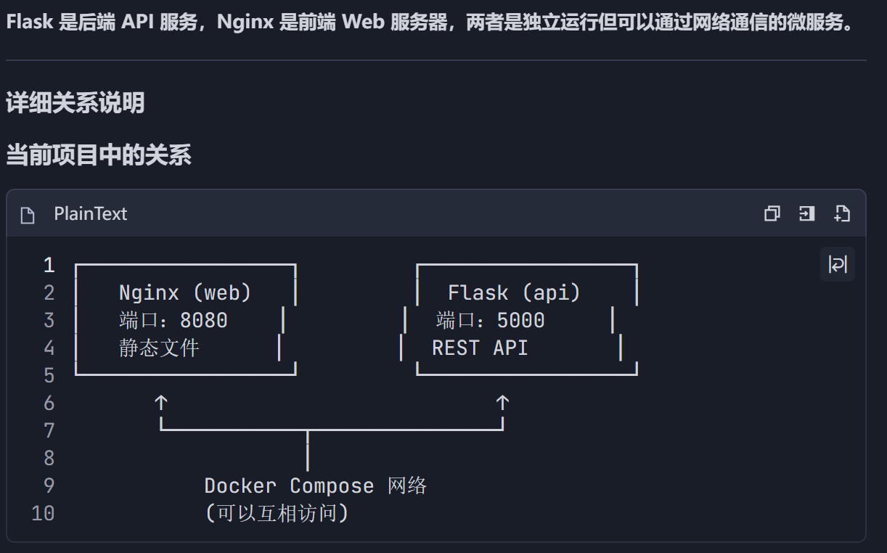

docker-compose up -d，启动docker-compose.yml中的容器。

api（flask后端功能）镜像不是拉取来的，而是build构建出来的。

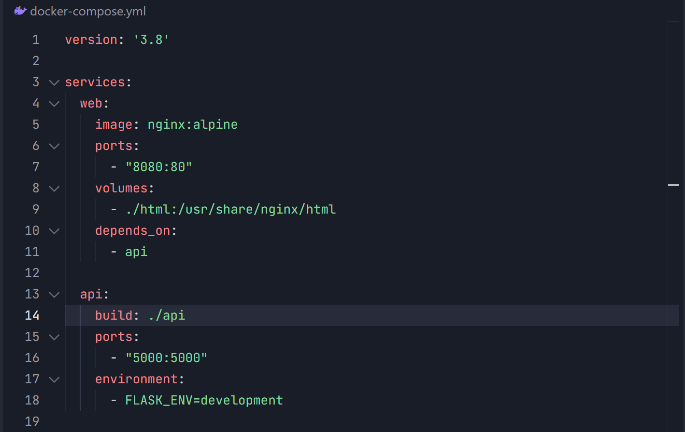

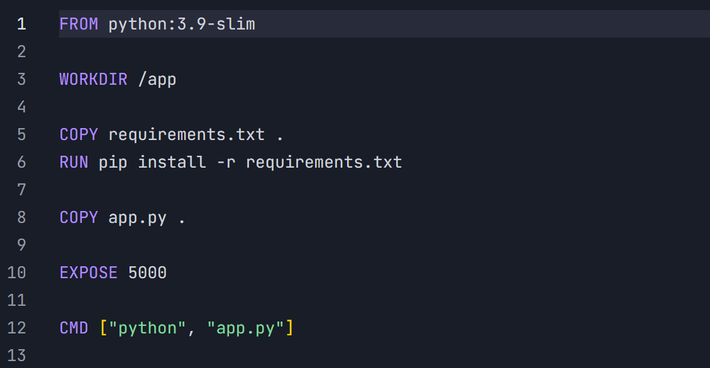

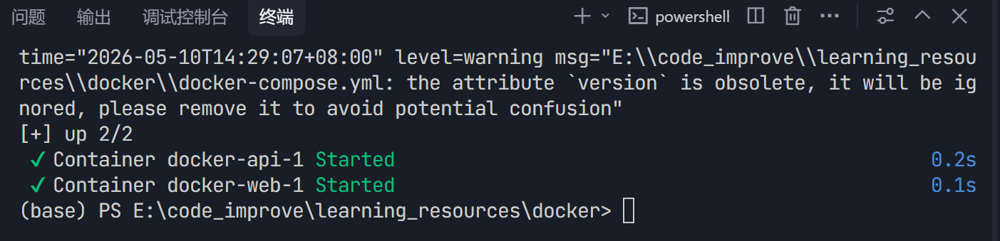

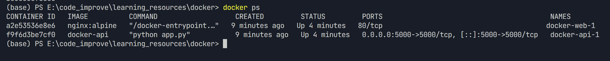

### 5.3 常用命令

```bash
# 启动所有服务（根据docker-compose.yml文件）
docker-compose up -d

# 查看服务状态
docker-compose ps

# 查看日志
docker-compose logs -f

# 停止所有服务
docker-compose down

# 停止并删除数据卷
docker-compose down -v

# 重建服务
docker-compose up -d --build

# 执行命令
docker-compose exec api bash
```

## 附录：常用命令速查

### 镜像管理
```bash
docker pull <image>          # 拉取镜像
docker push <image>          # 推送镜像
docker images                # 列出镜像
docker rmi <image>           # 删除镜像
docker build -t <tag> .      # 构建镜像
docker history <image>       # 查看镜像历史
```

### 容器管理
```bash
docker run <image>           # 运行容器
docker ps                    # 查看运行中容器
docker stop <container>      # 停止容器
docker start <container>     # 启动容器
docker rm <container>        # 删除容器
docker logs <container>      # 查看日志
docker exec -it <c> bash     # 进入容器
docker inspect <container>   # 查看详细信息
```

### 清理命令
```bash
docker system prune          # 清理未使用资源
docker container prune       # 删除停止的容器
docker image prune           # 删除悬空镜像
docker volume prune          # 删除未使用卷
```

### 删除容器/镜像：

首先停止容器，删除容器，最后才可以删除镜像。

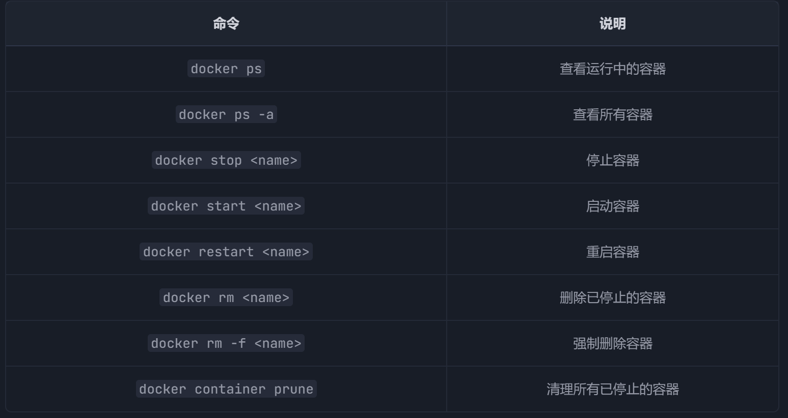

docker images查看所有容器

docker rmi ID/镜像名 ，删除镜像。

# More_about_docker

有待补充
