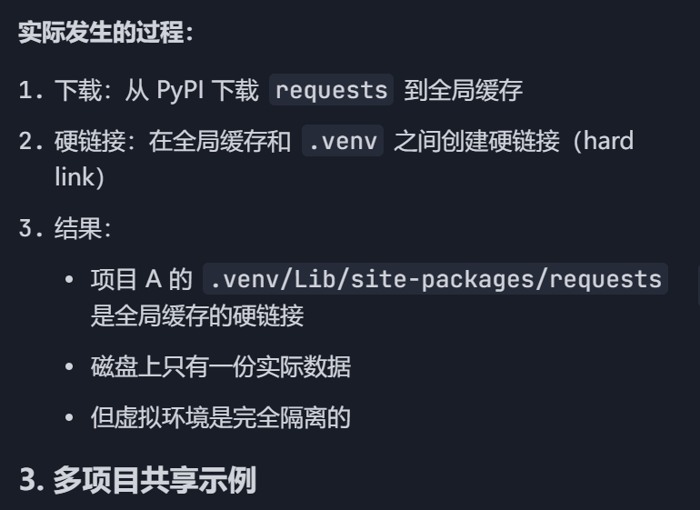

# UV 快速入门指南

## 一、什么是 uv？

uv 是一个基于 Rust 的极速 Python 包管理工具，比 pip 快 10-100 倍。

核心功能：
- 包管理（替代 pip）
- Python 版本管理（替代 pyenv）
- 虚拟环境管理（替代 virtualenv）
- 依赖锁定（替代 poetry）

为啥uv这么快？


---

## 二、快速开始

### 1. 安装 uv（pip）

```bash
# Windows (PowerShell)
powershell -c "irm https://astral.sh/uv/install.ps1 | iex"

# macOS/Linux
curl -LsSf https://astral.sh/uv/install.sh | sh

# 或使用 pip 安装（推荐）
pip install uv
```

### 2. 创建新项目

```bash
# 初始化项目
uv init my_project
cd my_project

# 自动创建：
# - pyproject.toml (项目配置)
# - .venv/ (虚拟环境)
# - uv.lock (依赖锁定文件)
```

### 3. 添加依赖

```bash
# 添加生产依赖
uv add requests fastapi

# 添加开发依赖
uv add --dev pytest black
```

### 4. 运行代码
uv run 会自动在虚拟环境中运行后面的命令，如果没有虚拟环境，则会根据pyproject.toml创建一个。
```bash
# 在虚拟环境中运行
uv run python main.py

# 或直接运行模块
uv run pytest
```

### 5. 同步环境（见五重要文件说明）
`uv sync` 会根据 `uv.lock` 安装/更新依赖到虚拟环境。
如果 `uv.lock` 不存在或已过时，`uv sync` 会自动先更新它。

可以类比 `pip install -r requirements.txt`

```bash
# 同步依赖到虚拟环境
uv sync
```

---

## 三、完整使用流程示例

```bash
# 1. 创建项目
uv init fastapi-demo
cd fastapi-demo

# 2. 添加依赖
uv add fastapi uvicorn
uv add --dev pytest ruff

# 3. 运行应用
uv run uvicorn main:app --reload

# 4. 运行测试
uv run pytest

# 5. 代码检查
uv run ruff check .
```

---

## 四、uv 命令大全

### 项目管理

| 命令 | 说明 |
|------|------|
| `uv init <项目名>` | 创建新项目 |
| `uv add <包名>` | 添加依赖 |
| `uv add --dev <包名>` | 添加开发依赖 |
| `uv remove <包名>` | 移除依赖 |
| `uv sync` | 同步依赖到 uv.lock |
| `uv lock` | 生成/更新 uv.lock |
| `uv lock --upgrade` | 升级所有依赖 |
| `uv run <命令>` | 在虚拟环境中运行 |
| `uv run --with <包> <脚本>` | 临时安装包并运行 |

### Python 版本管理

| 命令 | 说明 |
|------|------|
| `uv python install <版本>` | 安装 Python 版本 |
| `uv python list` | 列出可用版本 |
| `uv python pin <版本>` | 为项目指定 Python 版本 |
| `uv python find` | 查找已安装的 Python |

### 虚拟环境

| 命令 | 说明 |
|------|------|
| `uv venv` | 创建虚拟环境 |
| `uv venv --python <版本>` | 指定 Python 版本创建环境 |

### 工具管理

| 命令 | 说明 |
|------|------|
| `uvx <工具>` | 临时运行工具 |
| `uv tool run <工具>` | 临时运行工具（同上） |
| `uv tool install <工具>` | 永久安装工具 |
| `uv tool list` | 列出已安装工具 |
| `uv tool uninstall <工具>` | 卸载工具 |

### pip 兼容命令

| 命令 | 说明 |
|------|------|
| `uv pip install <包>` | 安装包 |
| `uv pip install -r requirements.txt` | 从文件安装 |
| `uv pip uninstall <包>` | 卸载包 |
| `uv pip list` | 列出已安装包 |
| `uv pip tree` | 显示依赖树 |
| `uv pip freeze` | 导出依赖列表 |
| `uv pip compile requirements.in` | 编译依赖 |

### 其他命令

| 命令 | 说明 |
|------|------|
| `uv --version` | 查看版本 |
| `uv self update` | 更新 uv |
| `uv help` | 查看帮助 |
| `uv help <命令>` | 查看命令帮助 |
| `uv cache dir` | 查看缓存目录 |
| `uv cache clean` | 清理缓存 |

---

## 五、重要文件说明

### pyproject.toml

声明项目所需要的依赖，可以通过pip install .来安装其中的依赖内容。

```toml
[project]
name = "my-project"
version = "0.1.0"
requires-python = ">=3.12"
dependencies = [
    "fastapi>=0.100.0",
    "requests>=2.28.0",
]

[project.optional-dependencies]
dev = [
    "pytest>=7.0",
    "black>=23.0",
]
```

### uv.lock（uv特有的文件）

记录的是实际安装的依赖的版本。uv sync命令自动读取 pyproject.toml 和 uv.lock文件，安装依赖项到虚拟环境中。

- 自动生成的依赖锁定文件
- 记录所有依赖的**精确版本**和**哈希值**
- ✅ 应该提交到 Git
- ❌ 不要手动编辑

### .python-version
- 记录项目使用的 Python 版本
- 例如：`3.12`

